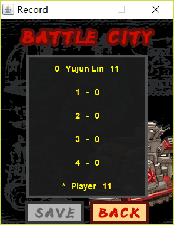

Battle City
====================================
(Latest update: 2017/06/30)

坦克大战是由日本南梦宫Namco游戏公司开发的一款平面射击游戏，于1985年发售。游戏以坦克战斗及保卫基地为主题，属于策略型联机类游戏。

Introduction to implemented functions 游戏功能介绍
==================================================

实验实现的Java版本的坦克大战游戏包括了**单机双人、网络联机双人模式**，提供了**准备、暂停、继续、实时显示得分、保存/展示历史纪录**等功能，并且**具有背景音乐和音效**，**重新绘制了游戏UI**。

Start up 启动
-------------

点击运行游戏后，会显示Start
up界面，背景音乐为经典坦克大战启动的背景音乐。在Start
up界面，提供了4个按钮功能：进入单机双人游戏模式、创建网络联机双人游戏模式的房间、进入网络联机双人游戏模式的房间、退出。

Room 房间
---------

当点击“创建房间”时，游戏会弹出对话框，询问要建立的房间号(即本机要用于网络通信的端口号)，如果成功绑定端口，则进入房间room
界面，成为房主。

当点击“进入房间”时，游戏会弹出对话框，询问要进入的房间所在的IP地址和房间号，如果成功建立连接且房间有位置空余，则进入房间room
界面，成为宾客。

房间界面有2个按钮功能：准备和退出。当房主点击“退出”时，游戏双方都会退出房间界面，房间被关闭。当宾客点击“退出”时，只有宾客退出房间，而房主仍留在房间，等待新的宾客进入。任何一方点击“准备”时，界面会更新相应方的状态显示。当双方都点击准备后，游戏将自动开始。

Game 游戏
---------

当在start
up界面点击“单机游戏”按钮功能后，或者在room界面双方都点击了“准备”按钮功能后，游戏将进入游戏Game界面。游戏共有3张地图，每次游戏随机选择地图。当游戏结束时，游戏将弹出对话框，提示输赢，同时播放相应的背景音乐。

### 单机双人游戏操作方法

玩家1通过$\uparrow$，$\downarrow$, $\leftarrow$,
$\rightarrow$控制坦克的上下左右移动，通过空格(space)控制坦克射击。玩家2通过w,s,a,d控制坦克的上下左右移动，通过f控制坦克射击。每次射击均有射击音效。

### 联机双人游戏操作方法

玩家双方均通过$\uparrow$，$\downarrow$, $\leftarrow$,
$\rightarrow$控制坦克的上下左右移动，通过空格(space)控制坦克射击。每次射击均有射击音效。**宾客端游戏界面可能会因为网速延迟而显得卡顿。**

### 游戏规则

1.  射击的最短间隔为500ms。

2.  普通墙中弹一次就被破坏，钢墙不能被破坏。

3.  坦克不能越过普通墙、钢墙、海洋，可以穿过草地，但会被草地覆盖。

4.  敌方坦克有2种：普通坦克和加强坦克。普通坦克中弹一次就被破坏，加强坦克中弹两次就被破坏。

5.  敌方坦克共有21辆，随机时刻在游戏界面顶部出现随机型号。

6.  我方坦克均为普通坦克，共有4个生命值。每中弹一次，就损失一个生命值，并且回到初始位置。当生命值为0时，坦克被破坏。

7.  如果敌方坦克全部被消灭，则我方获胜。如果我方基地被攻破或者我方坦克全部被消灭则我方失败。

Game Information 游戏信息
-------------------------

紧邻Game游戏界面是游戏信息界面。游戏信息界面将提供如下信息：

1.  剩余敌方坦克数：初始将显示21个坦克，每出现一个坦克，则减少1个。注意，破坏一个敌方坦克，并不会使其减少。

2.  玩家名：Player 1 或 Player 2

3.  玩家坦克型号、颜色

4.  玩家剩余生命值

5.  玩家所得分数：破坏一个普通坦克获得1分，破坏一个加强坦克获得3分。

同时游戏信息界面有2个按钮功能：暂停、继续。点击“暂停”，游戏将暂停；点击“继续”，游戏将继续。游戏开始时，“继续”按钮无效，“暂停”按钮有效；点击“暂停”后，“继续”按钮有效，“暂停”按钮无效；点击“继续”后，“继续”按钮无效，“暂停”按钮有效。

Record 游戏记录
---------------

当游戏结束后，将进入游戏记录界面。该程序会记录历史得分最高的5个分数。游戏记录界面将显示Top
5的分数，同时提供2个按钮功能：保存记录、返回。

单机双人游戏模式中，较高分数将会被显示在历史纪录排行榜下；联机双人游戏模式中，将会各自显示自己的分数在历史纪录排行榜下。如果玩家分数高于历史纪录的最低分，则“保存记录”按钮有效，点击“保存记录”后，将弹出询问玩家名字的对话框。

点击“返回”按钮，如果是单机双人游戏模式，将返回start
up启动界面；如果是联机双人游戏模式，且网络连接未切断，则返回room界面，双方准备状态重置为“未准备”，否则将关闭房间，返回start
up启动界面。

UI design 游戏界面设计
======================

Start up GUI 启动界面
---------------------

游戏start
up启动界面有四个按钮：Local、Create、Enter、Exit，分别表示功能：进入单机双人游戏模式、创建网络联机双人游戏模式的房间、进入网络联机双人游戏模式的房间、退出。

如图所示，启动界面使用BoxLayout垂直分布格局。

Room GUI 房间界面
-----------------

游戏room房间界面有两个按钮：Prepare、Exit，分别表示功能：准备和退出。当双方均点击“Prepare”后，游戏将自动开始。

如图所示，房间界面使用BoxLayout垂直分布格局，来排布玩家信息容器和按钮容器。玩家信息容器使用GridBagLayout格局来排布坦克图标、玩家网络地址(Host和Port)、玩家准备状态。

Game GUI 游戏界面
-----------------

游戏Game游戏界面包含两个主要部分：游戏局面、游戏信息界面。

游戏局面中，如图所示，共有3种地图，每次开局随机选择其中一张地图。玩家1是绿色坦克，玩家2是蓝色坦克，敌方普通坦克是灰色坦克，敌方加强坦克是橙色坦克。

游戏信息界面中，共分为3个部分：敌方坦克剩余信息、玩家信息、按钮容器。敌方坦克剩余信息将显示生育坦克数目，以小橙点表示。玩家信息包括：玩家坦克样式、玩家坦克生命值、玩家得分。按钮容器包含两个按钮：Pause、Restart，分别对应功能：暂停、继续。

Record GUI 纪录界面
-------------------

游戏Record纪录界面包含2个部分：纪录显示、按钮容器。纪录显示采用BoxLayout垂直分布格局，分别显示历史前5名分数、玩家得分。按钮容器包括两个按钮：Save和Exit，分别对应功能：保存、返回。

Package and Class design 游戏包和类设计
=======================================

如图所示，游戏java程序含有三个包和一个主类：游戏控制gameControl包、游戏界面gameGUI包、游戏网络通信gameNetwork包、主类BattleCity。

gameControl 游戏控制包
----------------------

gameControl包含有一个包和八个类：状态state包、坦克Tank类、敌方坦克EnemyTank类、我方坦克SelfTank类、子弹Shot类、游戏信息GameInfo类、客户端控制GameClientController类、服务器端控制GameServerController类、游戏配置GameConfig类。

### state 状态包

state包含有5个枚举类和一个普通类：GameState游戏状态类、CellState单元格状态类、Direction方向类、Key键值类、PressState按下状态类、KeyState键状态类。

#### **GameState 游戏状态类**

GameState游戏状态类是枚举类，标志游戏局面的输赢状态。它包含了如下状态：PLAYING进行中、WIN获胜、LOSE失败、WIN\_OVER获胜且双方获知结果、LOSE\_OVER失败且双方获知结果、PAUSE暂停、ERROR出错。

#### **CellState 单元格状态类**

CellState单元格状态状态类是枚举类，标志游戏局面的单元格的状态。它包含了如下状态：EMPTY(空)、NORMAL\_WALL(普通墙)、STELL\_WALL(钢墙)、SEA(海洋)、TANK(坦克)。

#### **Direction 方向类**

Direction方向类是枚举类，标志坦克、子弹的方向状态。它包含了如下状态：UP(上)、DOWN(下)、LEFT(左)、RIGHT(右)、STAY(方向保持不变)。

#### **Key**键值类

Key键值类是枚举类，标志键的值。它包含了如下值：UP(上)、DOWN(下)、LEFT(左)、RIGHT(右)、SHOOT(射击)、NOTHING(无或无效)。

#### **PressState 按下状态类**

PressState按下状态类是枚举类，标志一个结算周期内键的按下状态。它包含了如下状态：PRESSED(按下)、NEVER\_PRESSED(从未被按下)、ONCE\_PRESSED(曾被按下)。

#### **KeyState 键状态类**

KeyState键状态类是普通类，它有成员变量Key键值类和PressState按下状态类，标志一个结算周期内有动作的键值和其按下状态。

### Tank 坦克类

Tank坦克类是实现坦克功能的基本类，它可以(public)返回坦克属性(getID(),
isSelf())、位置信息(getX(),
getY())、方向信息(getDirection())、生命值信息(getNumLife())用于绘图和统计。同时，可以(package)返回运动信息(isMoved())、射击信息(isShoot())、伤害信息(underAttacked(),
isDead())，也可以(package)完成转向(setDirection())、移动(Move())操作。

### EnemyTank 敌方坦克类

EnemyTank敌方坦克类继承Tank坦克类，它(package)实现了转向(setDirection())操作。

### SelfTank 我方坦克类

SelfTank我方坦克类继承Tank坦克类，它(package)实现了按键(setKeyState())、转向(setDirection())、射击(isShoot())操作。

### Shot 子弹类

Shot子弹类是实现子弹功能的基本类，它可以(public)返回位置信息(getX(),
getY())用于绘图。同时可以(package)完成移动(Move())操作和返回子弹属性(getID(),
isSelf())、方向信息(getDirection())。

### GameInfo 游戏信息类

GameInfo游戏信息类是存储游戏局面信息的基本类，包括了草地信息、局面信息、坦克队列、子弹队列、统计信息、游戏状态。

### GameClientController 客户端控制类

GameClientController客户端控制类是宾客方游戏的控制类，不完成游戏规则的逻辑功能，只负责调用重绘局面。

### GameServerController 服务器端控制类

GameServerController服务器控制类是服务器方游戏的控制类，完成游戏规则的逻辑功能并调用重绘局面。

### GameConfig 游戏配置类

GameConfig游戏配置类包括了游戏的主要配置，例如地图、帧率等。

gameGUI 游戏界面包
------------------

### element GUI元素包

#### **ImageButton 图片按钮类**

ImageButton图片按钮类继承JButton类，实现用图片初始化按钮。

#### **ImageLabel 图片标签类**

ImageLabel图片按钮类继承JLable类，实现用图片初始化标签。

#### **MyGridBagConstraints 格局约束类**

MyGridBagConstraints格局约束类继承GridBagConstraints，封装以方便初始化其参数。

#### **SoundEffect 音乐音效类**

SoundEffect音乐音效类是枚举类，标志音效。它包含如下音乐音效：STARTUP(启动背景音乐)、ROOM(进入房间背景音乐)、SHOOT(射击音效)、WIN(获胜音效)、LOSE(失败音效)。

### StartupGUI 启动界面类

StartupGUI启动界面类是启动界面的GUI类，继承JFrame。

### RoomGUI 房间界面类

RoomGUI房间界面类是房间界面的GUI类，继承JFrame。

### BoardPanel 局面界面容器类

BoardPanel局面界面容器类是局面绘制的容器，继承JPanel。

### GameInfoPanel 游戏信息界面容器类

GameInfoPanel游戏信息界面容器类是显示游戏统计信息界面的容器，继承JPanel。

### GameKeyListener 游戏键盘监听类

GameKeyListener游戏键盘监听类是监听玩家在游戏时按键的监听器类，继承KeyListener。

### GameGUI 游戏界面类

GameGU游戏界面类是游戏界面的GUI类，包括了BoardPanel局面界面容器类成员和GameInfoPanel游戏信息界面容器类成员，继承JPanel。

### RecordGUI 纪录界面类

RecordGUI纪录界面类是纪录界面的GUI类，继承JFrame。

### GUIConfig 界面配置类

GUIConfig界面配置类包括了游戏界面的主要配置，例如各个界面的尺寸、各个容器的尺寸等。

gameNetwork 游戏网络通信包
--------------------------

### ClientState 客户端状态类

ClientState客户端状态类是枚举类，标志客户端的状态。它包含如下状态：CONNECTED(已连接)、SERVER\_PREPARED(房主准备)、CLIENT\_PREPARED(宾客准备)、PREPARED(双方准备)、EXIT(退出)、ERROR(出错)。

### ServerState 服务器端状态类

ServerState服务器端状态类是枚举类，标志服务器端的状态。它包含如下状态：WAITING(等待连接)、WAITING\_SERVER\_PREPARED(等待连接且房主准备)、CONNECTED(已连接)、SERVER\_PREPARED(房主准备)、CLIENT\_PREPARED(宾客准备)、PREPARED(双方准备)、EXIT(退出)、ERROR(出错)。

### GameSocket 游戏套接字类

GameSocket游戏套接字类负责套接字的收发信息。

### GameClient 游戏客户端类

GameClient游戏客户端类是客户端与网络交互的线程类，它分别在房间界面和游戏界面时启动不同线程与服务器端交互。

### GameServer 游戏服务器端类

GameServer游戏服务器端类是服务器端与网络交互的线程类，它分别在房间界面和游戏界面时启动不同线程与客户端交互。

### GameProtocol 游戏协议类

GameProtocol游戏协议类是游戏通信的信息配置类，它规定了请求加入房间信息(JoinPacket)、退出游戏信息(ExitPacket)、准备游戏信息(PreparedPacket)、按键信息(KeyPacket)等信息格式，同时可以完成判别信息的功能。

BattleCity 坦克大战主类
-----------------------

BattleCity坦克大战主类将唤醒start up启动界面，开始坦克大战程序的运行。

Network Communication 游戏网络通信策略
======================================

Create a room and enter 创建房间/进入房间
-----------------------------------------

服务器端和客户端在建立房间、创建房间时网络通信情况如图所示。当创建房间时，GameServer会启动线程，等待连接。当有client连接后，GameServer会更新状态为CONNECTED状态(如果原来是WAITING状态)或SERVER\_PREPARED状态(如果原来是WAITING\_SERVER\_PREPARED)，此后其它client连接，此线程均会发送exit
packet来拒绝进入房间。

Playing the game 游戏进行中
---------------------------

服务器端和客户端在游戏过程中时网络通信情况如图所示。

Synchronization 游戏状态同步策略
================================

每开始一局比赛，程序都会调用GameGUI.waitForOver()，开启一个新的线程，来等待游戏的结束(胜利/失败/出错)，进行收尾的操作。程序中任何有改变游戏状态的地方，都会notifyAll来唤醒该线程进行判断。

程序将游戏分为三个部分：结算逻辑运算、更改成员(坦克/子弹)状态、绘图。

结算逻辑运算
------------

联机模式下，结算逻辑运算和更改成员状态只在服务器端进行，并将依照帧率，每隔一段时间进行。结算逻辑运算包括，

-   随机生成敌方坦克

-   确定场上坦克、子弹方向

-   遍历坦克，生成子弹

-   判断子弹是否击中墙面

-   判断坦克是否中弹

-   移动子弹

-   移动坦克

-   如果要实现，子弹是坦克N倍速，则进入循环。循环内：调用绘图；判断子弹是否击中墙面；判断坦克是否中弹；移动子弹

-   游戏输赢决策

-   调用绘图

更改成员(坦克/子弹/游戏)状态
----------------------------

单机模式下，GameKeyListener将引用玩家1和2的SelfTank，通过监听键盘状态来更改相应的我方坦克的状态。GameGUI增加按钮监听器，通过监听按钮状态来更改游戏状态(PLAYING/PAUSE)。

联机模式服务器端，GameKeyListener将引用房主的SelfTank，通过监听键盘状态来更改房主的我方坦克的状态。而GameServer将引用宾客的SelfTank，通过线程接收来自客户端的消息，然后根据packet内容，或是更改宾客的SelfTank，或是调用click服务器端的按钮。

联机模式客户端，不能修改成员状态。GameKeyListener将引用GameClient，通过监听键盘状态来向服务器端发送KeyState
packet。同时，GameGUI增加按钮监听器，通过监听按钮状态来向服务器发送GameState
packet。

绘图
----

单机模式下，或联机模式服务器端，GameServerController在决算逻辑运算中调用repaint进行绘图。

联机模式客户端，因为不进行决算逻辑运算，故，有两条线程：

-   接收来自服务器端的GameInfo，然后根据GameInfo来更新GameClientController的GameInfo

-   GameClientController根据帧率，每隔一段时间调用repaint进行绘图。

Synchronization on GameInfo 游戏信息类的同步
--------------------------------------------

整个游戏关键信息均包含在游戏信息类中。故，游戏信息类有成员stateLock，在所有更改游戏信息类的操作中，都会上锁stateLock，进行线程间的同步。
